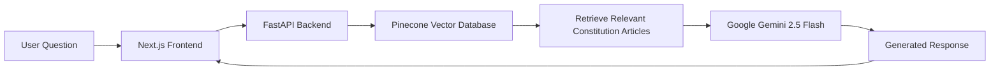

# Pakistan Constitution AI Chatbot

An AI powered legal assistant that answers questions about the **Constitution of Pakistan** using **Retrieval Augmented Generation (RAG)**. The application combines semantic search with a Large Language Model (LLM) to generate accurate, context aware responses based on constitutional documents.

> **Built with:** FastAPI • Next.js • Pinecone • Google Gemini • Tailwind CSS • TypeScript

---

## Overview

The Constitution of Pakistan is a lengthy legal document, making it difficult for citizens, students and professionals to quickly locate relevant articles and understand constitutional provisions.

This project addresses that challenge by leveraging **Retrieval Augmented Generation (RAG)**. Instead of relying solely on an LLM's internal knowledge, the chatbot retrieves the most relevant constitutional sections from a vector database before generating a response. This results in more accurate, reliable and context-aware answers.

---

## Features

- AI powered constitutional question answering
- Retrieval Augmented Generation (RAG) pipeline
- Semantic search using Pinecone Vector Database
- Context aware responses generated with Google Gemini
- Modern ChatGPT inspired user interface
- Fully responsive design for desktop and mobile
- Pakistan themed UI
- FastAPI backend with REST API
- Next.js frontend with Tailwind CSS

---

# System Architecture



---

# How It Works

1. The user submits a question through the web interface.
2. The FastAPI backend converts the query into embeddings.
3. Pinecone performs semantic similarity search to retrieve the most relevant constitutional sections.
4. The retrieved context is passed to Google Gemini.
5. Gemini generates a context aware response based on the retrieved constitutional content.
6. The answer is displayed in the chat interface.

---

# Project Structure

```text
pak_constitution/
│
├── backend/
│   ├── backend.py
│   ├── requirements.txt
│   └── .env.example
│
├── frontend/
│   ├── app/
│   │   ├── page.tsx
│   │   ├── contact/
│   │   ├── layout.tsx
│   │   └── globals.css
│   │
│   ├── package.json
│   └── ...
│
└── README.md
```

---

# 🛠️ Tech Stack

| Category | Technology |
|-----------|------------|
| Frontend | Next.js 16, React, TypeScript |
| Styling | Tailwind CSS |
| Backend | FastAPI |
| LLM | Google Gemini 2.5 Flash |
| Vector Database | Pinecone |
| Embedding Model | llama-text-embed-v2 |
| Retrieval | Retrieval-Augmented Generation (RAG) |

---

# Screenshots

### Home Page


---

### Chat Interface


---

# Installation

## 1. Clone the Repository

```bash
git clone https://github.com/yourusername/pakistan-constitution-chatbot.git

cd pakistan-constitution-chatbot
```

---

## Backend Setup

Navigate to the backend folder:

```bash
cd backend
```

Create a virtual environment:

```bash
python -m venv venv
```

Activate the environment:

**Windows**

```bash
venv\Scripts\activate
```

**Linux / macOS**

```bash
source venv/bin/activate
```

Install dependencies:

```bash
pip install -r requirements.txt
```

Copy the environment template:

```bash
cp .env.example .env
```

Add your API keys:

```env
PINECONE_API_KEY=YOUR_PINECONE_API_KEY
GEMINI_API_KEY=YOUR_GEMINI_API_KEY
```

Run the FastAPI server:

```bash
uvicorn backend:app --reload
```

Backend runs at:

```
http://localhost:8000
```

---

## Frontend Setup

Navigate to the frontend folder:

```bash
cd frontend
```

Install dependencies:

```bash
npm install
```

Create a `.env.local` file:

```env
NEXT_PUBLIC_API_URL=http://localhost:8000
```

Start the development server:

```bash
npm run dev
```

Frontend runs at:

```
http://localhost:3000
```

---

# API Endpoints

## Ask a Question

**POST** `/ask`

Request:

```json
{
  "question": "What are the Fundamental Rights in the Constitution of Pakistan?"
}
```

---

## Health Check

**GET**

```
/health
```

---

# Deployment

## Backend

Deploy the FastAPI backend using platforms such as:

- Railway
- Render
- Azure App Service
- AWS EC2

Ensure the following environment variables are configured:

- `PINECONE_API_KEY`
- `GEMINI_API_KEY`

---

## Frontend

Deploy the Next.js application on:

- Vercel
- Netlify

Set:

```env
NEXT_PUBLIC_API_URL=<YOUR_BACKEND_URL>
```

---

# Future Improvements

- User authentication
- Conversation history
- Source citations for retrieved articles
- Multi language support (English & Urdu)
- Voice based interaction
- Streaming AI responses
- Article bookmarking
- Advanced legal search filters

---

# License

This project is intended for educational and research purposes.

---

## Author

Developed with ❤️ to improve access to constitutional knowledge through AI.
